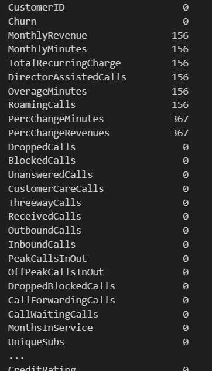
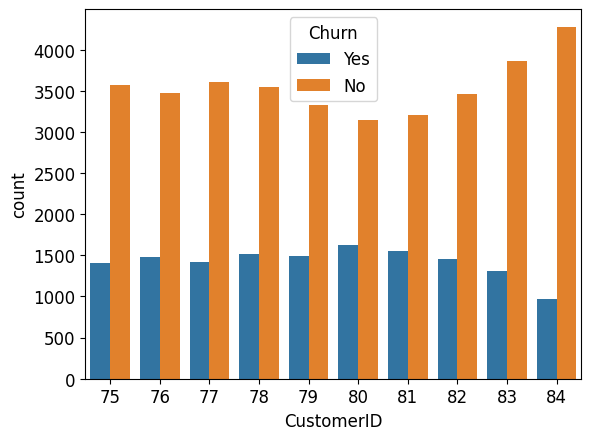
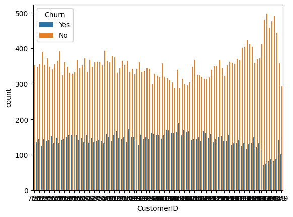
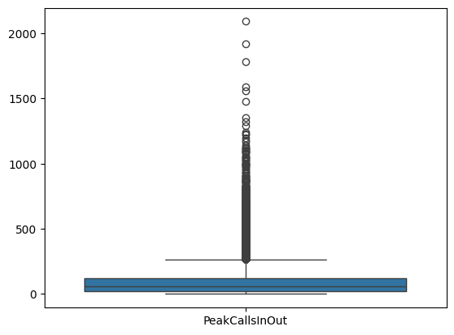
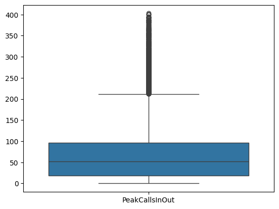
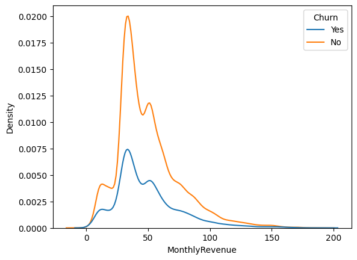
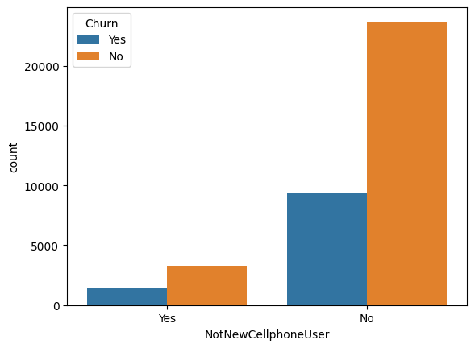

# SK네트웍스 4기 2번째 프로젝트 2조
<hr>
### 팀 소개

### 팀명 | 😎기도가 좋다🙏

### 팀원 소개
<p align="center">
        
        
        
        
        
  
<div align="center">
|   &nbsp;&nbsp; &nbsp; &nbsp; &nbsp;  &nbsp;  &nbsp;권오셈 &nbsp;&nbsp; &nbsp;&nbsp; &nbsp;  &nbsp;  &nbsp;    |      &nbsp;&nbsp; &nbsp;&nbsp; &nbsp;  &nbsp;  &nbsp;오창준  &nbsp;&nbsp; &nbsp;&nbsp; &nbsp;  &nbsp;  &nbsp;    |      &nbsp;&nbsp; &nbsp;&nbsp; &nbsp;  &nbsp;  &nbsp;박화랑  &nbsp;&nbsp; &nbsp;&nbsp; &nbsp;  &nbsp;  &nbsp;    |     &nbsp;&nbsp; &nbsp;&nbsp; &nbsp;  &nbsp;  &nbsp;김효은  &nbsp;&nbsp; &nbsp;&nbsp; &nbsp;  &nbsp;  &nbsp;   | 
||------------------------------------------|||--------------------------------------|||------------------------------------------|||-----------------------------------||
|DB 및 총괄|크롤링 / streamlit|크롤링 / streamlit|크롤링 / streamlit|
</div>

### 데이터 분석 목표
>
<hr>
- 통신사의 고객별 사용량,요금,고객의 소득, 통화 패턴 등 여러 데이터를 이탈 여부와 ML,DL모델을 통해 결부시켜, 고객 데이터들 통해 향후 고객 이탈 예측 및 대응방안 강구


###EDA

여기 주어진 데이터셋의 설명을 기반으로 README 파일에 들어갈 수 있는 표를 만들어드릴게요:

---


### 데이터 로드 및 결측치, 중복값 확인

```python
# 결측치 확인
data.isna().sum()
```


```python
# 결측치 최대 3515개
# 전부 drop해도 최소 약47000개 정도 남으니까 전부 drop
data.isna().sum().sum() 
data = data.dropna().reset_index(drop=True)
```
```python
data.duplicated().sum() # 중복값 확인, 결과는 0
```

### EDA 및 전처리

``` python
new_data_1 = data.filter(items=['Churn', 'CustomerID']) # CustomterID가 Index역할을 하고 있는데 혹시 범위별로 묶으면 유의미한 변수일까 확인
new_data_1.CustomerID = new_data_1.CustomerID//40000 # CustomerID 범주화 40000개씩 묶음
new_data_1

sns.countplot(
    new_data_1,
    x= 'CustomerID',
    hue= 'Churn'
)
# 범주를 묶어서 확인해 봤는데 유의미한 변화 X
```


```python
# 더 세부적으로 묶음
new_data_1 = data.filter(items=['Churn', 'CustomerID'])
new_data_1.CustomerID = new_data_1.CustomerID//4000 # 이번에는 CustomerID 4000개씩 묶음
sns.countplot(
    new_data_1,
    x= 'CustomerID',
    hue= 'Churn'
)
# 마찬가지로 의미없음 그래서 CustomerID drop
```


```python
# 숫자형 데이터 boxplot 찍어보기
# 사분위 수 범위에서 크게 벗어나는 애들 제거
sns.boxplot(
    data.loc[:, (data.dtypes != object)].iloc[:, [16]],
)
```


```python
# Z-score 활용해서 이상치 제거
columns_to_zscore = ['MonthlyRevenue', 'MonthlyMinutes', 'TotalRecurringCharge',
       'DirectorAssistedCalls', 'OverageMinutes', 'RoamingCalls',
       'PercChangeMinutes', 'PercChangeRevenues', 'DroppedCalls',
       'BlockedCalls', 'UnansweredCalls', 'CustomerCareCalls', 'ThreewayCalls',
       'ReceivedCalls', 'OutboundCalls', 'InboundCalls', 'PeakCallsInOut',
       'OffPeakCallsInOut', 'DroppedBlockedCalls', 'CallForwardingCalls',
       'CallWaitingCalls', 'MonthsInService', 'UniqueSubs', 'ActiveSubs',
       'Handsets', 'HandsetModels', 'CurrentEquipmentDays', 'AgeHH1', 'AgeHH2',
       'RetentionCalls', 'RetentionOffersAccepted',
       'ReferralsMadeBySubscriber', 'IncomeGroup',
       'AdjustmentsToCreditRating']
z_scores = stats.zscore(data[columns_to_zscore])
outliers_mask = (abs(z_scores) > 3).any(axis=1)
data = data[~outliers_mask]

# 만족스럽게 제거 됐는지 확인
sns.boxplot(
    data.loc[:, (data.dtypes != object)].iloc[:, [16]],
)
``` 


```python
# 이상치 제거 후 0으로 통일된 값들 확인 후 drop
data.loc[:, (data.sum() == 0)].value_counts()
data = data.drop(columns=['RetentionCalls', 'RetentionOffersAccepted', 'ReferralsMadeBySubscriber'])
```

### 수치형데이터 확률밀도함수 확인 (데이터 분포)
```python
sns.kdeplot(
    data,
    x= data.loc[:, (data.dtypes != object)].columns[0],
    hue='Churn'
)
```


```python
# 범주형데이터 데이터 분포 확인

sns.countplot(
    data,
    x=data.loc[:, (data.dtypes == object)].columns[15],
    hue='Churn'             
)
```


```python
# object형 숫자형으로 바꿔주기
label_encoders = {}
for column in data.loc[:, (data.dtypes == object)].columns:
    label_encoder = LabelEncoder()
    data.loc[:, column] = label_encoder.fit_transform(data[column])

    label_encoders.update({column: label_encoder})

data = data.astype(dict(zip(np.extract(data.dtypes == object , data.columns), ['float']*23)))

# csv 내보내기
data.to_csv('./data/preprocessing_train.csv', index= False)
```


###DL

-DL 여기에

###ML

-ML여기에

